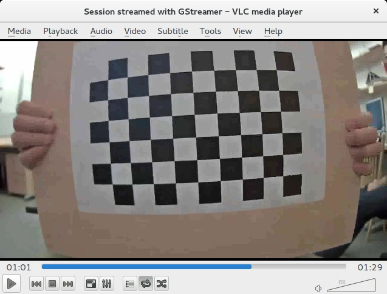

Camera Calibration Using OpenCV
===============================

Python scripts for camera intrinsic parameters calibration and image undistortion.

It finds following parameters:

  * focal length
  * principal point
  * radial distortion coefficients

using video of a moving chessboard pattern or a sequence of images as an input.

Example input: 

Example output YAML file:

~~~
camera_matrix:
- [1016.5691777733053, 0.0, 632.3505845656954]
- [0.0, 1013.9401023559311, 351.0453222243043]
- [0.0, 0.0, 1.0]
dist_coefs:
- [-0.3797582960152331, 0.20896823985868346, -0.0003239082442461539, -0.0019027617884934114,
  -0.0668551319250156]
rms: 1.1814231691868478
~~~

Installation
------------

Requirements:

  * numpy
  * PyYAML
  * OpenCV

requirements installatio using `pip`:
~~~
$ pip install -r requirements.txt
~~~

Camera Calibration
------------------

 1. print the pattern.png and glue it to a solid board
 3. fix the camera lens zoom, the calibration values change with the lens zoom changes
 2. record a video with the pattern moving in front of the camera
    * the pattern should be most of the time completely visible
    * try to move the pattern to cover all parts of the camera view, pay attention to the corners
    * the length of the video should be 1 or 2 minutes
 3. run the calibration.py to extract chessboard pattern corners from the video and perform camera calibration

Example usage (you can actually run the example, the input data is present in the ./example_input):

~~~
$ ./calibrate.py --help
usage: calibrate.py [-h] [--debug-dir DEBUG_DIR] [-c CORNERS] [-fs FRAMESTEP]
                    input out

Calibrate camera using a video of a chessboard or a sequence of images.

positional arguments:
  input                 input video file or glob mask
  out                   output calibration yaml file

optional arguments:
  -h, --help            show this help message and exit
  --debug-dir DEBUG_DIR
                        path to directory where images with detected
                        chessboard will be written
  -c CORNERS, --corners CORNERS
                        output corners file
  -fs FRAMESTEP, --framestep FRAMESTEP
                        use every nth frame in the video

$ mkdir out
$ ./calibrate.py example_input/chessboard.avi calibration.yaml --debug-dir out
Searching for chessboard in frame 0... not found
Searching for chessboard in frame 20... not found
Searching for chessboard in frame 40... not found
Searching for chessboard in frame 60... not found
Searching for chessboard in frame 80... not found
Searching for chessboard in frame 100... not found
Searching for chessboard in frame 120... not found
Searching for chessboard in frame 140... ok
Searching for chessboard in frame 160... ok
Searching for chessboard in frame 180... ok
Searching for chessboard in frame 200... ok
Searching for chessboard in frame 220... ok
Searching for chessboard in frame 240... ok
Searching for chessboard in frame 260... ok
Searching for chessboard in frame 280... ok
...
Searching for chessboard in frame 1980... ok
Searching for chessboard in frame 2000... ok
Searching for chessboard in frame 2020... ok
Searching for chessboard in frame 2040... not found
Searching for chessboard in frame 2060... not found
Searching for chessboard in frame 2080... not found
Searching for chessboard in frame 2100... ok
Searching for chessboard in frame 2120... not found
Searching for chessboard in frame 2140... not found
Searching for chessboard in frame 2160... not found
Searching for chessboard in frame 2180... not found

Performing calibration...
RMS: 1.01973939405
camera matrix:
[[ 774.55857698    0.          619.69416634]
 [   0.          772.96410156  352.49790333]
 [   0.            0.            1.        ]]
distortion coefficients:  [ -3.65385859e-01   1.63224385e-01  -2.67163331e-03   3.38261891e-04
  -3.81711948e-02]

~~~

Removing Radial Distortion
--------------------------

You can test the found radial distortion coefficients by removing distortion from an image and checking if straight lines are really straight.

~~~
$ ./undistort.py --help
usage: undistort.py [-h] calibration input_mask out

Undistort images based on camera calibration.

positional arguments:
  calibration  input video file
  input_mask   input mask
  out          output directory

optional arguments:
  -h, --help   show this help message and exit

$ ./undistort.py calibration.yaml 'example_input/*.png' out/
processing example_input/distorted.png... ok

~~~

License
-------

MIT License, except `pattern.png` from OpenCV (3-clause BSD License).